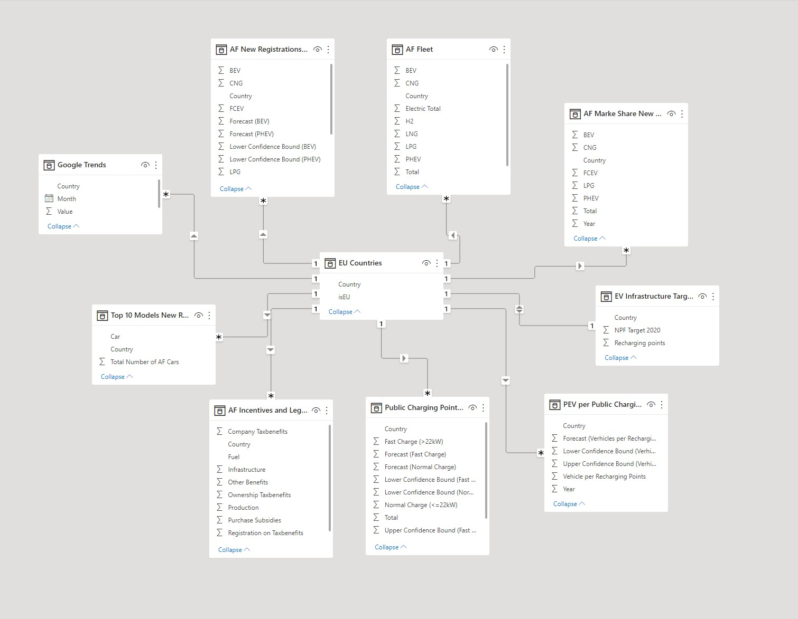
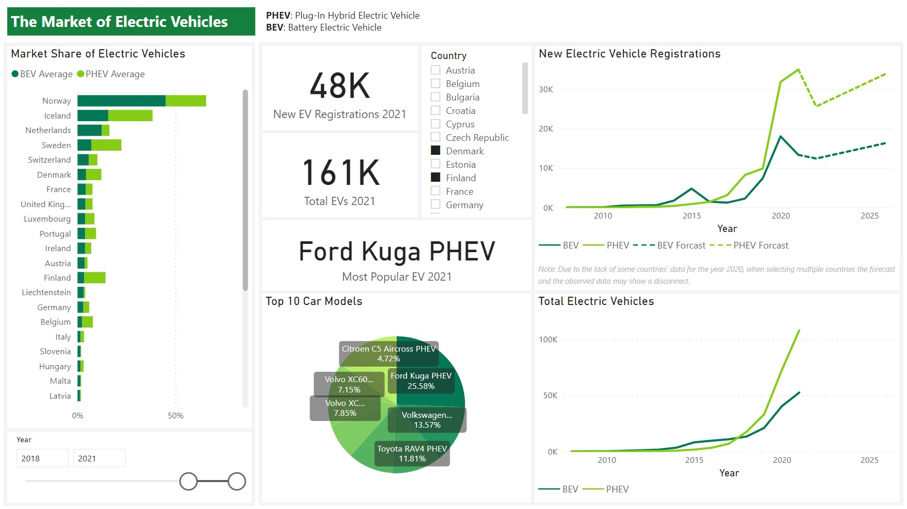
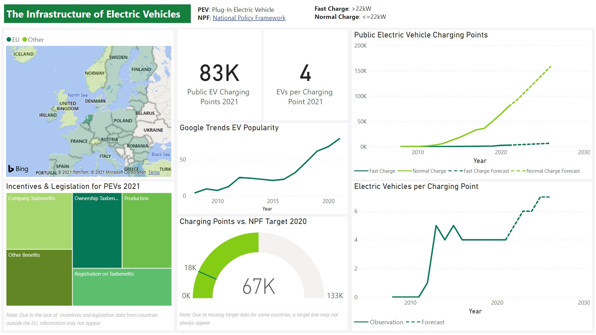

# Europe's Electric Vehicle Infrastructure and Market—A Performance Dashboard

This interactive dashboard provides private and public decision-makers with an overview of the infrastructure and market situation of passenger electric vehicles in Europe. It highlights many key performance indicators (KPIs) and targets by illustrating trends through various graphs and maps. It was built with *Microsoft Power BI* and *Excel* using a *star schema* database modeling approach to organize the multi-dimensional KPIs. The dashboard includes many interactive graphs that change based on what year and country are selected. It also displays static 2021 (2020) KPIs we found most important to give users a reference point (for the *then* current situation).
## Data Preparation and Database Integration

After downloading the data from the European Alternative Fuels Observatory, we cleaned it by deleting null values, changing data types of attributes, and removing irrelevant entries. Following this, we connected the dimension tables—our key performance indicators (KPIs)—to our fact table—a list of EU countries—using primary and foreign keys in Power BI. We modeled our database using a star schema approach.

    

    

    
</p

The performance dashboard file `dashboard.pbix` can be opened in Microsoft Power BI.

## References

We mainly used data from the [European Alternative Fuels Observatory (EAFO)](https://eafo.eu). For the EV popularity index, we used data from [Google Trends](https://trends.google.com) for the keyword "electric vehicle" translated into each country's most-used language. We translated the word using [Google Translate](https://translate.google.com/) and used the first suggested translation.

European Alternative Fuels Observatory. (2008–2021a). *Alternative fuels (electricity) charging infra stats | EAFO* [Dataset]. [https://www.eafo.eu/alternative-fuels/electricity/charging-infra-stats](https://www.eafo.eu/alternative-fuels/electricity/charging-infra-stats)

European Alternative Fuels Observatory. (2008–2021b). *Vehicle and fleet data (passenger cars)* [Dataset]. [https://www.eafo.eu/vehicles-and-fleet/m1](https://www.eafo.eu/vehicles-and-fleet/m1)

European Alternative Fuels Observatory. (2021). *Incentives and Legislation* [Dataset]. [https://www.eafo.eu/countries/european-union/23640/incentives](https://www.eafo.eu/countries/european-union/23640/incentives)
